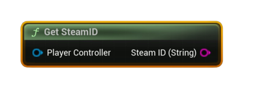

# Get Steam ID

Returns the local player’s **SteamID64** as a string from a given Player Controller.

#### Inputs
| `Pin` | `Type` | `Description` |
| --- | --- | --- |
| `Player Controller` | `APlayerController` | The controller whose Steam ID you want to read. |

#### Outputs
| `Pin` | `Type` | `Description` |
| --- | --- | --- |
| `SteamID` | `String` | The player’s SteamID64 (e.g., `7656119...`). Empty if unavailable. |

<h3><b>Notes</b></h3>
<ul style="font-size:0.72rem; line-height:1.75">
  <li><b>Pure</b> node (no async work).</li>
  <li>If <code>PlayerController</code> or its <code>PlayerState</code>/<code>UniqueId</code> is missing, the output is an empty string.</li>
  <li>Uses the engine’s <code>UniqueNetId</code> → for Steam it resolves to <b>SteamID64</b>.</li>
</ul>

